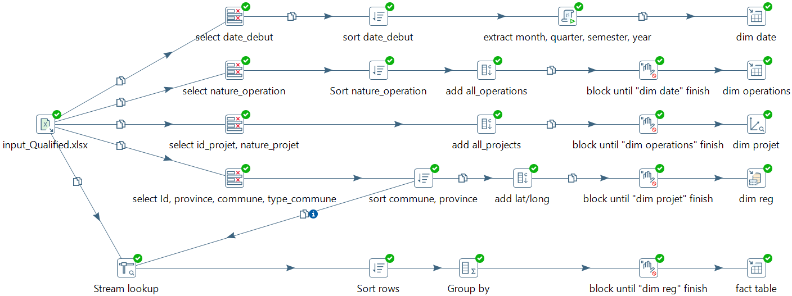

## Mise en place d'un système décisionnel pour l'analyse des données

Les fichiers présents dans ce projet sont:
 
 - Un <a href="TALAGHZI_Hamza__Omrane_Pentaho.pdf">rapport au format PDF</a> représentant les différentes étapes du projet. <a href="https://github.com/h3t1/bi/raw/main/TALAGHZI_Hamza__Omrane_Pentaho.pdf" download="TALAGHZI_Hamza__Omrane_Pentaho.pdf">Télécharger</a>
 
 

  
  
Fig1: page de couverture du <a href="TALAGHZI_Hamza__Omrane_Pentaho.pdf">rapport</a>

 

 - Un ichier de transformation <a href="etl_omrane.ktr">etl_omrane.ktr</a> pour l'extraction des données et l'alimentation des tables de dimensions et la table de faits.
 
 

  
  
Fig2: Exemple d'exécution de la transformation <a href="etl_omrane.ktr">etl_omrane.ktr</a> sur PDI

 

- Un fichier de transformation <a href="set_lat_long.ktr">set_lat_long.ktr</a> pour pour l'extraction et le remplissage des valeurs de latitude et de longitude.
 
 

  
  
Fig3: Exemple d'exécution de la transformation <a href="set_lat_long.ktr">set_lat_long.ktr</a> sur PDI

- Un fichier excel <a href="input_Qualified.xls">input_Qualified.xls</a> contenant les données à traiter.
 
 

  
  
Fig4: – Extrait du fichier Excel contenat les données en question: <a href="input_Qualified.xls">input_Qualified.xls</a>

